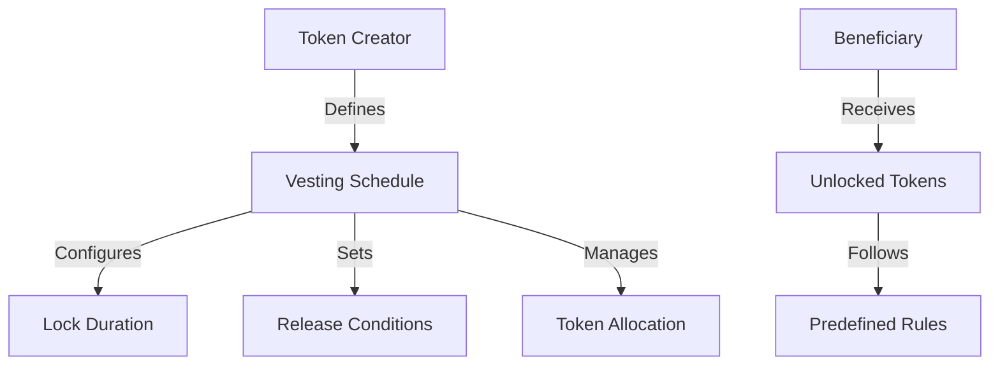

# Timelock Utility

A secure Clarity smart contract for managing time-locked token releases and sophisticated vesting schedules on the Stacks blockchain.

## Overview

Timelock Utility enables:
- Configurable token release schedules
- Granular control over asset distribution
- Secure, programmable vesting mechanisms
- Transparent and immutable token management
- Flexible lock-up and release strategies

### Key Features
- Create complex vesting schedules
- Support for multiple token types
- Configurable release conditions
- Precise time-based token unlocking
- Automated distribution controls
- Trustless asset management

## Architecture

The Timelock Utility is built on a core smart contract that manages token locks, release conditions, and distribution rules.



### Core Components
- Token Locking Mechanism
- Vesting Schedule Management
- Conditional Release Logic
- Transparent Distribution Tracking
- Secure Asset Control

## Contract Documentation

### timelock-core.clar

The main contract that handles token timelock functionality.

#### Key Data Structures
- Token allocation details
- Vesting schedule configurations
- Release condition mappings
- Unlock tracking mechanisms

#### Access Control
- Schedule creation: Token creator
- Token release: Conditional and time-based
- Modification: Limited and controlled

## Getting Started

### Prerequisites
- Clarinet
- Stacks wallet for deployment

### Installation
1. Clone the repository
2. Install dependencies with Clarinet
3. Deploy contracts to desired network

### Basic Usage

1. Create a token lock:
```clarity
(contract-call? .timelock-core create-vesting-schedule 
    "Marketing Tokens" 
    tx-sender 
    u100000 
    u1000 
    u5000 
    true)
```

2. Release tokens:
```clarity
(contract-call? .timelock-core release-tokens 
    schedule-id)
```

## Function Reference

### Vesting Schedule Management

```clarity
(create-vesting-schedule 
    (name (string-ascii 50)) 
    (beneficiary principal)
    (total-amount uint)
    (cliff-duration uint)
    (total-duration uint)
    (revocable bool))
```

```clarity
(modify-vesting-schedule 
    (schedule-id uint) 
    (new-total-amount uint))
```

### Token Release

```clarity
(release-tokens (schedule-id uint))
(revoke-vesting-schedule (schedule-id uint))
```

### Query Functions

```clarity
(get-vesting-schedule (schedule-id uint))
(get-releasable-amount (schedule-id uint))
(get-total-locked-amount (beneficiary principal))
```

## Development

### Testing
Run tests using Clarinet:
```bash
clarinet test
```

### Local Development
1. Start Clarinet console:
```bash
clarinet console
```

2. Deploy contracts:
```bash
clarinet deploy
```

## Security Considerations

### Limitations
- Block height-based timing
- Maximum token allocation restrictions
- Non-transferable locked tokens

### Best Practices
- Carefully define vesting schedules
- Implement multi-signature controls
- Validate beneficiary addresses
- Monitor token release conditions
- Implement emergency revocation mechanisms

### Governance Guidelines
- Use time-based and condition-based locks
- Implement gradual token release
- Consider cliff periods and linear vesting
- Maintain transparency in token allocation